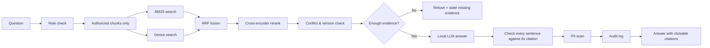
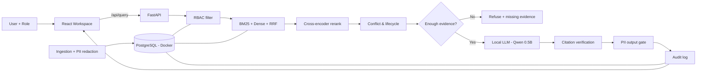

# Arogya: Evidence-Before-Generation Engine

**Escape Velocity Hackathon 1.0 · Track P-02: Healthcare Greenfield Enterprise RAG**

Arogya is an enterprise retrieval-augmented system over a (synthetic) hospital's knowledge:
clinical guidelines, SOPs, a drug formulary table, payer policy, a device manual and restricted
adverse-event audit records. It is built around one rule from the problem statement,
*a confident wrong answer is more expensive than no answer*, so every answer must prove why it
is allowed to exist:

1. evidence exists, **and the role is authorized to retrieve it** (enforced before scoring);
2. document lifecycle (active / superseded) is considered;
3. disagreeing sources are **surfaced**, never silently merged;
4. evidence is **sufficient**, otherwise the system refuses and says what is missing;
5. each answer sentence is **verified against the passage it cites**;
6. identifiers cannot leak (privacy gate at ingestion, query, model input and output);
7. every query is audited, and quality is measured on a reproducible 15-question benchmark.

> All documents, patients, identifiers, payers and devices are **synthetic**. Not for clinical use.

## Quick start (commands to run)

No API key is needed: every model runs locally. You need Docker Desktop, Python 3.11+ and Node 20+.

```bash
# 0. one-time: create your local secrets file and set a password in it (never commit .env)
cp .env.example .env

# 1. start PostgreSQL (Docker)
docker compose up -d

# 2. start the backend  →  http://127.0.0.1:8010
cd rag-pipeline
pip install -r requirements.txt
python server.py

# 3. start the frontend (new terminal)  →  http://localhost:5173
cd frontend
npm install
npm run dev

# optional: tests and the 15-question benchmark
cd rag-pipeline
python -m pytest tests -q
python evaluator.py
```

Open **http://localhost:5173/ai-analysis**, pick a role in the header, and ask a question.
The first start downloads the local models (~2.2 GB, once).

## RAG pipeline in one line

**Question → role check → authorized chunks only → BM25 + dense search → RRF fusion → cross-encoder rerank → conflict & version check → enough evidence? (no → refuse) → local LLM answer → every sentence checked against its citation → PII scan → audit log → answer with clickable citations**



**Why PostgreSQL:** one local, reliable source of truth for documents, versions, chunks,
embeddings, role permissions, audit logs and evaluation runs. Access rules and lifecycle live in
the database and are enforced server-side, and it runs in Docker so setup is a single command.

## Architecture

```
Synthetic corpus (MD / CSV / JSON)
  → Parser engine (front matter, heading hierarchy, row/record atomic)
  → PII/PHI gate (field + pattern redaction, identifier-hash registry)
  → Structure-aware chunking with provenance (section, lines, table/row, record)
  → PostgreSQL (documents, versions, chunks + embeddings, table rows, ACL, audit, eval)
  → Role → authorized candidate set (pre-retrieval ACL)
  → BM25 (rank_bm25)  +  dense (all-MiniLM-L6-v2)  → Reciprocal Rank Fusion
  → Cross-encoder rerank (BAAI/bge-reranker-base)
  → Conflict + lifecycle resolver
  → Evidence sufficiency gate ──► refusal (no generation)
  → Grounded local LLM synthesis (Qwen2.5-0.5B-Instruct on CPU, authorized evidence only)
  → Claim/citation verification (unsupported sentences removed)
  → Output privacy gate → audit event → React evidence workspace
```

Details: [docs/ARCHITECTURE.md](docs/ARCHITECTURE.md) · [RETRIEVAL](docs/RETRIEVAL.md) ·
[SECURITY](docs/SECURITY.md) · [CONFLICTS](docs/CONFLICTS.md) · [CITATIONS](docs/CITATIONS.md) ·
[DATA_MODEL](docs/DATA_MODEL.md) · [API](docs/API.md) · [EVALUATION](docs/EVALUATION.md) ·
[TESTING](docs/TESTING.md) · [UI_UX](docs/UI_UX.md) · [DEMO](docs/DEMO.md) ·
[REQUIREMENTS traceability](docs/REQUIREMENTS.md)

## Repository layout

```
rag-pipeline/            FastAPI backend + RAG pipeline (Python 3.12)
  corpus/                6 synthetic source documents, manifest.json, eval_questions.json
  config.py database.py rbac.py privacy.py ingest.py models.py retriever.py
  conflict_and_lifecycle.py sufficiency.py generation.py synthesizer.py pipeline.py
  evaluator.py server.py tests/
frontend/                React 19 + Vite + Tailwind (3 routes)
evaluation/results/      latest.json written by every benchmark run
docs/                    implementation documentation
context/                 hackathon problem context (read-only)
```

## Setup

Prerequisites: Python 3.11+, Node 20+, Docker Desktop (pgvector **not** required).

### 1. PostgreSQL (Docker)

```bash
cp .env.example .env          # set POSTGRES_PASSWORD and the same password in DATABASE_URL
docker compose up -d          # postgres:16-alpine, container arogya-postgres, localhost:5432, volume arogya_pgdata
docker compose ps             # wait for "(healthy)"
```
The repo-root `.env` (git-ignored) is read by both `docker-compose.yml` and the backend
(`rag-pipeline/config.py`). Tables are created by the backend's idempotent migration
(`database.init_schema()`, run on every server start). If a native PostgreSQL service already
listens on 5432, stop it first (Windows: `net stop postgresql-x64-18`).

| Task | Command |
|---|---|
| Start | `docker compose up -d` |
| Stop (keep data) | `docker compose stop` |
| Remove container (keep data) | `docker compose down` |
| Reset database (delete all data) | `docker compose down -v && docker compose up -d` |
| psql shell | `docker exec -it arogya-postgres psql -U postgres -d arogya_rag` |

DBeaver / any client: host `localhost`, port `5432`, database `arogya_rag`, user `postgres`,
password = `POSTGRES_PASSWORD` from `.env`.

### 2. Backend

```bash
cd rag-pipeline
pip install -r requirements.txt
python ingest.py        # optional: (re)ingest corpus/ explicitly; server also bootstraps on first start
python server.py        # http://127.0.0.1:8010
```
First start downloads/loads the models from Hugging Face into the local cache
(`all-MiniLM-L6-v2`, `bge-reranker-base`, `Qwen2.5-0.5B-Instruct`, ~2.2 GB total). Everything runs on CPU.

Generation provider (explicit, no silent cloud fallback; there is no cloud provider in the code):
`GENERATION_PROVIDER=transformers` (default, local HF model) · `ollama` (localhost daemon only) ·
`extractive` (deterministic local evidence-sentence composer).

### 3. Frontend

```bash
cd frontend
npm install
npm run dev             # http://localhost:5173 (Vite proxies /api → 127.0.0.1:8010)
```

### 4. Corpus generation

The corpus in `rag-pipeline/corpus/` was authored for this project and is fully synthetic.
Markdown files carry metadata in front matter, the CSV's metadata is in `manifest.json`, and the
JSON carries a `document` block. New documents can be ingested through **+ Ingest Doc** in the
workspace or `POST /api/ingest`; they go through the same parser, privacy gate, chunker, ACL
and embedding path.

### 5. Evaluation

```bash
cd rag-pipeline && python evaluator.py      # or the dashboard button → POST /api/evaluate
```
Writes `evaluation/results/latest.json` and persists `evaluation_runs` / `evaluation_results`.

### 6. Tests

```bash
cd rag-pipeline && python -m pytest tests -q
```

## Demo flow

See [docs/DEMO.md](docs/DEMO.md): normal answer → one-click citation → conflict (2025 guideline vs
superseded 2021 SOP) → refusal → RBAC (Billing Specialist refused, Compliance Auditor answered)
→ formulary row citation → `ERR-404` exact-code retrieval → live benchmark.

## Measured results

Live benchmark run `201a5188` (15 questions through the real pipeline, generator
`Qwen/Qwen2.5-0.5B-Instruct` on CPU). Full output: `evaluation/results/latest.json`. Method: [docs/EVALUATION.md](docs/EVALUATION.md).

| Passed | Groundedness | Citation precision | Conflict detection | Refusal accuracy | PII leakage | Unauthorized evidence |
|---|---|---|---|---|---|---|
| 15/15 | 62.5% (25/40 draft claims) | 100% (22/22) | 100% (3/3, 0% false positives) | 100% | 0% | 0% |

Groundedness measures the raw local generator. Unsupported sentences are removed before delivery.
Tests: `30 passed` (`python -m pytest tests -q`).

## Known limitations

* Roles are synthetic user contexts chosen in the UI and validated server-side; there is no
  identity provider/authentication.
* The privacy gate is deterministic pattern + registry matching tuned to this corpus, not
  certified clinical de-identification.
* Conflict detection covers quantitative regimen (dose + frequency) and timing claims; qualitative
  contradictions (e.g. "recommended" vs "not recommended") are not detected.
* Claim verification is lexical (content-word overlap + exact numbers), not an NLI model; it can
  reject correct paraphrases and does not prove semantic entailment.
* The 0.5B local generator often omits `[n]` markers; such sentences are attributed only when they
  pass verification (flagged `auto-attributed`). If no sentence verifies, a labelled local
  extractive fallback is shown.
* PDF/XLSX parsers are not enabled (the parser registry raises a clear error; adding one does not
  change the rest of the pipeline). The corpus is small (6 documents); the chunker is
  section-bounded so long documents chunk the same way, but ~200-page PDFs were not tested.
* Embeddings are held in PostgreSQL as `double precision[]` and searched in memory (no pgvector).

## Reused foundation vs new work

The React/Vite/Tailwind shell, colour palette, typography and `PillLoader` come from my earlier
ArogyaPlus project (written before the event). All consumer features and the client-side Gemini
integration were **removed**. The entire backend, corpus, ingestion, retrieval, RBAC, privacy,
conflict/lifecycle engine, refusal logic, synthesis/verification, audit, evaluation, tests and
the new workspace/dashboard UI were built for P-02. See
[docs/EXISTING_CODEBASE.md](docs/EXISTING_CODEBASE.md).

## AI Assistance Disclosure

**AI coding assistant used: Claude (Claude Code, by Anthropic).** Claude Code was used for
implementation assistance, code generation, debugging, test writing and documentation drafting.
All submitted code was reviewed and validated by the participant, and all reported metrics come
from evaluation runs of this repository.

## Synthetic data disclaimer

No real personal or patient data is used anywhere. Names such as "Synthia Testpatient", MRNs of
the form `SYN-MRN-000N`, `555-010-xxxx` phone numbers and `@example.test` emails are fabricated
to exercise the privacy controls.

## System flow



---

**Developed by [URAYUSHJAIN](https://github.com/URAYUSHJAIN)** for Escape Velocity Hackathon 1.0 (Track P-02).
